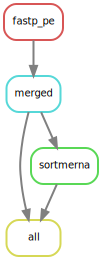
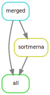

<p align="center">
<a href="https://hydra-genetics-prealignment.readthedocs.io">https://hydra-genetics-prealignment.readthedocs.io</a>
</p>

#  hydra-genetics/prealignment

#### Snakemake module containing processing steps that should be performed before sequence alignment


[](https://opensource.org/licenses/gpl-3.0.html)

 Visit  for more detailed information.

## :speech_balloon: Introduction

The module consists of alignment pre-processing steps, such as trimming and merging of `.fastq`-files
as well as filtering out rRNA sequences from RNA reads. We **strongly** recommend trimming `.fastq`-files
prior to alignment. To enable trimming the `trimmer_software`-stanza in the `config.yaml` may be set to
the name of the trimming rule, e.g. `fastp_pe`, or `None` if trimming should be omitted. For rRNA
filtering, SortMeRNA can be used. Input data should be specified via `samples.tsv` and `units.tsv`. 

## :heavy_exclamation_mark: Dependencies

In order to use this module, the following dependencies are required:

[](https://github.com/hydra-genetics/)
[](https://pandas.pydata.org/)
[](https://www.python.org/)
[](https://snakemake.readthedocs.io/en/stable/)
[](https://sylabs.io/docs/)

**Note! Releases of prealignment <= v0.4.0 needs tabulate<0.9.0 added in requirements.txt**

## :school_satchel: Preparations

### Sample and unit data

Input data should be added to [`samples.tsv`](https://github.com/hydra-genetics/prealignment/blob/develop/config/samples.tsv)
and [`units.tsv`](https://github.com/hydra-genetics/prealignment/blob/develop/config/units.tsv).
The following information need to be added to these files:

| Column Id | Description |
| --- | --- |
| **`samples.tsv`** |
| sample | unique sample/patient id, one per row |
| tumor_content | ratio of tumor cells to total cells |
| **`units.tsv`** |
| sample | same sample/patient id as in `samples.tsv` |
| type | data type identifier (one letter), can be one of **T**umor, **N**ormal, **R**NA |
| platform | type of sequencing platform, e.g. `NovaSeq` |
| machine | specific machine id, e.g. NovaSeq instruments have `@Axxxxx` |
| flowcell | identifer of flowcell used |
| lane | flowcell lane number |
| barcode | sequence library barcode/index, connect forward and reverse indices by `+`, e.g. `ATGC+ATGC` |
| fastq1/2 | absolute path to forward and reverse reads |
| adapter | adapter sequences to be trimmed, separated by comma |

### Reference data

An array of reference `.fasta`-files should be specified in `config.yaml` in the section `sortmerna` and
`fasta`. These files are readily available as part of the github repo. In addition, these files should be
indexed using SortMeRNA and the filepath set at `sortmerna` and `index`.

## :white_check_mark: Testing

The workflow repository contains a small test dataset `.tests/integration` which can be run like so:

```bash
$ cd .tests/integration
$ snakemake -s ../../Snakefile -j1 --configfile config.yaml --use-singularity
```

## :rocket: Usage

To use this module in your workflow, follow the description in the
[snakemake docs](https://snakemake.readthedocs.io/en/stable/snakefiles/modularization.html#modules).
Add the module to your `Snakefile` like so:

```bash
module prealignment:
    snakefile:
        github(
            "hydra-genetics/prealignment",
            path="workflow/Snakefile",
            tag="v1.0.0",
        )
    config:
        config


use rule * from prealignment as prealignment_*
```

### Output files

The following output files should be targeted via another rule:

| File | Description |
|---|---|
| `prealignment/merged/{sample}_{type}_fastq1.fastq.gz` | Merged and possibly trimmed foward reads |
| `prealignment/merged/{sample}_{type}_fastq2.fastq.gz` | Merged and possibly trimmed reverse reads |
| `prealignment/sortmerna/{sample}_{type}.fq.gz` | combined forward and reverse reads without rRNA sequences|


## :judge: Rule Graph

### Trim and merge fastq



### Only merge fastq


