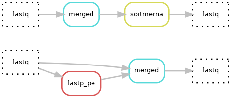

# Hydra-genetics prealignment module

{: style="height:40%;width:40%"}

<br />

The prealignment module consists of alignment pre-processing steps, such as trimming and merging of `.fastq`-files
as well as filtering out rRNA sequences from RNA reads. We **strongly** recommend trimming `.fastq`-files
prior to alignment. For rRNA filtering, SortMeRNA can additionally be used.

## Enable trimming

Trimmer software rule must be specified in your `config.yaml` file. Example:  
```yaml
trimmer_software: "fastp_pe"
```
Can be set to `None` for no trimming and only merging.

## [Input](https://hydra-genetics.readthedocs.io/en/read_the_docs/create_sample_files/)
Fastq files are the main input data of the prealignment module. These should be specified in `units.tsv` as well as sequencing meta data. See [input data](https://hydra-genetics.readthedocs.io/en/read_the_docs/create_sample_files/) for further information on how to generate these automatically from `.fastq` files.

Example `samples.tsv` with all required columns:

| sample |
|-|
| sample1 |

<br />
Example `units.tsv` with all required columns:

| sample | type | platform | machine | flowcell | lane | barcode | fastq1 | fastq2 | adapter |
|-|-|-|-|-|-|-|-|-|-|
| sample1 | N | NextSeq | NDX550220 | HKTG2BGXG | L001 | ACG+ACG | sample1_R1.fastq.gz | sample1_R2.fastq.gz | AGAT,ACAT |

<br />

## Output
Trimmed and merged fastq-files are the main output files of the prealignment module.
